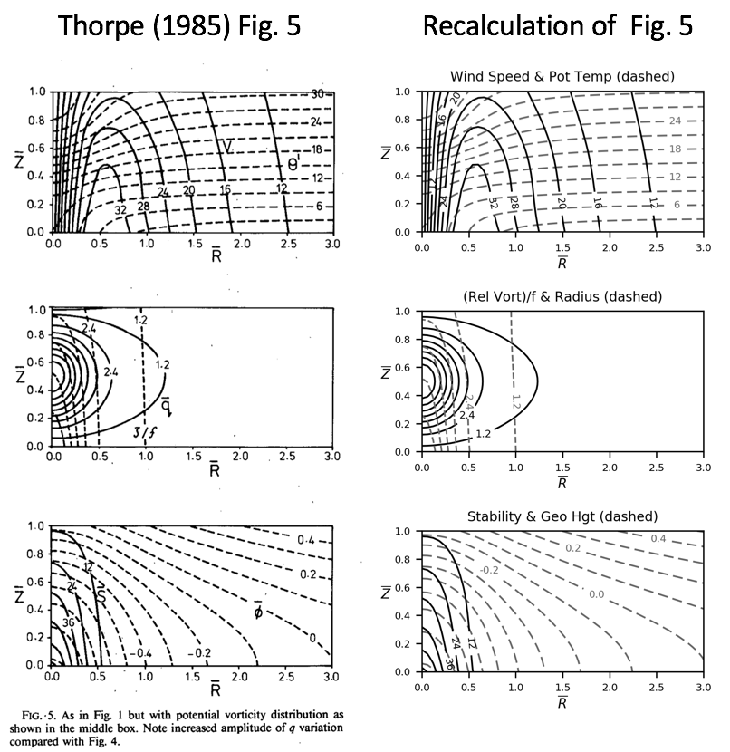

# thorpe_tropopause

<b> Overview </b>

This repository contains not-yet-fully-working python code to replicate the results of Thorpe (1985), Thorpe (1986), and Fig. 15a from Hoskins et al. (1985), which show the circulation for various axisymmetric distributions of potential vorticity and boundary variations in potential temperature.  There is a separate program for each figure considered, although the only changes are in the given conditions and parameter values.

The code appears to work for all the figures from Thorpe (1985) EXCEPT Fig. 3, the sloping tropopause case, although the results in that case are similar if the program is halted before convergence (as determined in terms of potential vorticity). It does not work yet for the figures from the other papers, although very similar results can be obtained by doubling the radial scale of the given conditions and halting before convergence.

Comparisons between the output of the programs and the original figures are provided in the "figures" folder of this repository.

<b> Summary of Results </b>

The code appears to work fine for Figs. 1, 2, 4, 5, and 6 from Thorpe (1985).  For example, here is a comparison for Fig. 5, which shows a close match. (Note that there appears to be a typo in the paper, it looks like the sine should be squared in the specification of the potential vorticity, which is what done here.)

However, Fig. 3 is a problem.  The fields look fairly similar if the program is stopped before reaching convergence (shown below) but only if also using different contour intervals for some of the fields.  At convergence, the tropopause has continued to lower a bit and the winds are stronger.  I don't know what to make of the geopotential shown in the figure - it's possible to analytically solve for at the lateral boundary and my analytical solution, which is the same as my numerical solution, doesn't appear to be consistent with the paramaters given in the paper.  It does appear to be consistent with keeping H as 10km but when I run the code that way, the results still doesn't match and I have to use a vertical limit of Z = 1.67, which is not what's shown in the original figure.

The issues continue with trying to reproduce the figures in Thorpe (1986) and Fig. 15a from Hoskins et al. (1985), although there is a clue.  I can obtain similar solutions if I double the radial scale (that is, doubling R0 in the specification of the tropopause slope and the domain shown).  This is true for the figures with only lower boundary conditions as well, so my problem seems to be in the overall setup of the code for the cases with a stratosphere, not something specific to the tropopause calculation.  For example, here is the comparison for Fig. 4 from Thorpe (1986) - warm core lower boundary condition - with my best guess as to how to set up the code:

and here is the comparison when I double the radial scale and halt before convergence when the results look the most similar:

<b> Further Discussion </b>

For simplicity, potential vorticity and potential temperature are linearly interpolated when determining the tropopause.  I have tried more sophisticated approaches but they didn't seem to make much difference and tended to cause convergence problems in some cases, so I did not include them here.  I also did some sensitivity tests with much higher resolution, and without any interpolation for potential vorticity (every grid box either has the tropospheric or stratospheric value with no intermediate values), and the way the tropopause is treated in the code does not appear to explain the differences from the original figures.  

Given the similarity between the results and the original figures for Thorpe (1986) and Fig. 15a from Hoskins et al. (1985) when I double the radial scale of the given conditions, I've either misunderstood something about the basic parameters, how to implement them, or have a bug somewhere. I've traded various permuations of different values but can't figure out the problem.

<b> Acknowledgements </b>

Support from NSF AGS-1623912 and NSF AGS-1657921 is gratefully acknowledged.

<b> References </b>

Hoskins, B.J., McIntyre, M.E. and Robertson, A.W., 1985. On the use and significance of isentropic potential vorticity maps. Quart. J. Roy. Meteor. Soc., 111, 877-946.

Thorpe, A.J., 1985: Diagnosis of balanced vortex structure using potential vorticity.  J. Atmos. Sci., 42, 397-406.

Thorpe, A.J., 1986: Synoptic Scale Disturbances with Circular Symmetry. Mon. Wea. Rev., 114, 1384–1389.
